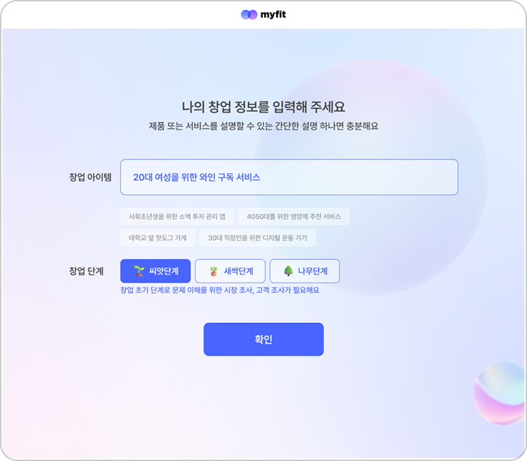
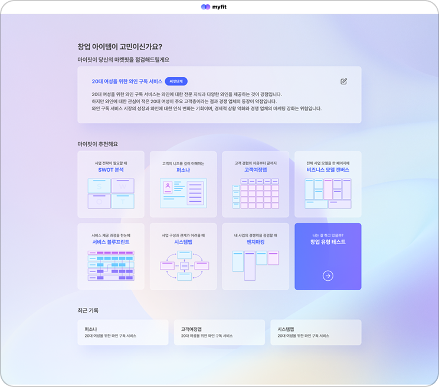
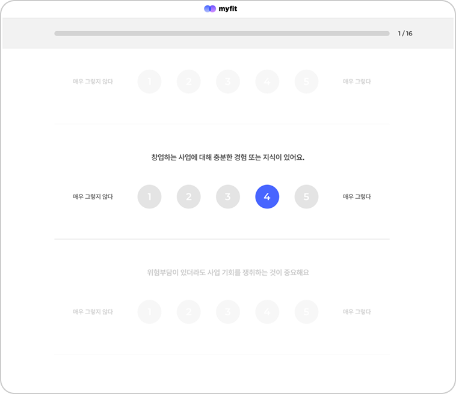
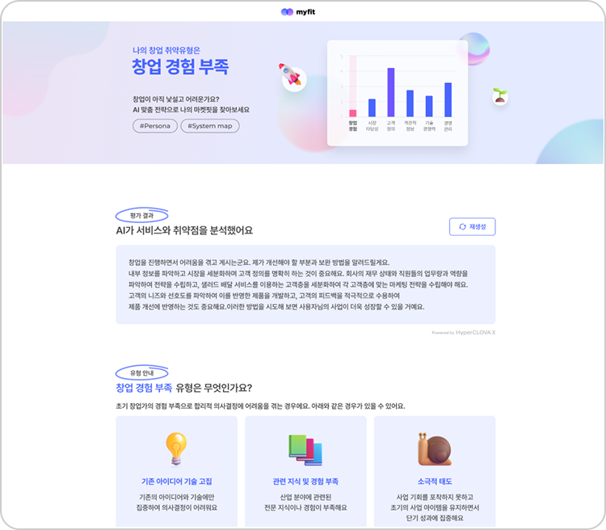
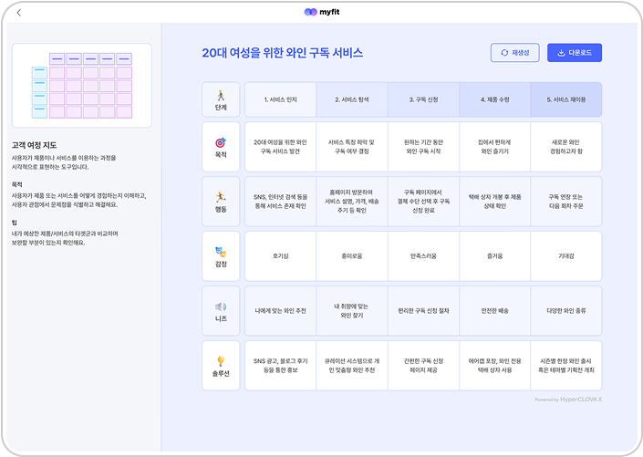

<div align="center">
  <br />
  
  <br />
  <h1>myfit</h1>
</div>

## Overview  
🔍 **MyFit**은 창업자들이 **제품-시장 적합성(Product-Market Fit, PMF)** 을 찾을 수 있도록 돕는 마켓핏 점검 서비스입니다.  
<br/>

### 🎯 프로젝트 개요  
이 프로젝트는 **네이버 클라우드 플랫폼이 주최한 해커톤**에서 HyperCLOVA X를 활용하여 개발되었습니다.

창업 아이템의 시장 적합성을 분석하고, 맞춤형 성장 전략을 제공하는 것을 목표로 합니다.  
<br />

### 🚀 주요 기능  

#### 📌 PMF 점검을 위한 AI 분석  
- **비즈니스 아이디어 입력** → AI가 시장 적합성을 분석하고 맞춤형 전략을 추천  
- **마켓핏 점검 도구 추천** → 적절한 서비스 디자인 도구를 제안하여 전략을 구체화  

#### 📌 창업 유형 테스트  
- 16가지 문항을 통해 창업자의 강점·취약점을 분석하고 맞춤형 전략을 제공  

#### 📌 비즈니스 방향성 제안  
- AI가 취약점을 보완할 성장 전략을 추천하고 실행 가능한 전략을 제시  

#### 📌 서비스 디자인 도구 지원  
- **SWOT 분석, 퍼소나, 비즈니스 모델 캔버스, 벤치마킹** 등 8가지 프레임워크 제공  
<br/>

### 📆 개발 기간  
2024년 8월 ~ 2024년 9월  
<br />

### 🔗 배포 주소  
[🌐 MyFit 서비스 바로가기](https://www.myfit.work/)  
<br />

## 🚀 Installation & Usage  

### 📌 Prerequisites  
다음 환경에서 정상적으로 동작합니다.  

- **Node.js**: `v18.19.0`  
- **Yarn**: `v1.22.21`  

설치되지 않은 경우, 아래 명령어로 설치하세요.  

```sh
# Node.js 설치 (권장: nvm 사용)
nvm install 18
nvm use 18

# Yarn 설치
npm install -g yarn
```
### 📥 Clone the Repository  
```sh
git clone https://github.com/dong-onion/myfit.git
cd myfit
```
### 📦 Install Dependencies
```sh
yarn install
```
### 🔧 Set Up Environment Variables
환경 변수 설정을 위해 `.env.example` 파일을 참고하여 `.env` 파일을 생성하세요.

해당 API Key들은 네이버 클라우드 플랫폼에서 생성해야 합니다.
```sh
cp .env.example .env
```

### 🚀 Start the Development Server
```sh
yarn start
```
<br/>

## 🛠️ Tech Stack  

### Frontend  
- **React** – 사용자 인터페이스 구성  
- **TypeScript** – 정적 타입을 통한 코드 안정성 향상  
- **React Query** – 데이터 패칭 및 상태 관리  
- **styled-components** – CSS-in-JS 스타일링  
- **react-router-dom** – 클라이언트 사이드 라우팅  

### Backend & Deployment  
- **Vercel Serverless Functions** – API 요청 처리 및 배포  
<br/>

## 📸 Features & UI  

| 서비스 입력 | 마켓핏 점검 도구 추천 |
| :--------: | :----------------: |
| 사용자가 비즈니스 아이디어를 입력하면, <br/> AI가 시장 적합성을 분석하고 맞춤형 전략을 추천합니다. <br/><br/>  | AI가 적절한 서비스 디자인 도구를 추천해, <br/> 더욱 구체적인 전략 수립을 돕습니다. <br/><br/>  |

| 창업 유형 점검 | 서비스 전략 확인 |
| :--------: | :------------: |
| 16가지 문항을 통해 창업자의 <br/> 강점·취약점을 분석하고, <br/> 맞춤형 전략을 제공합니다. <br/><br/>  | AI가 분석한 내용을 바탕으로 <br/> 실행 가능한 전략을 제공합니다. <br/><br/>  |

| 비즈니스 방향성 제안 |
| :--------------: |
| AI가 취약점을 보완할 성장 전략을 추천하고, <br/> 실행 가능한 전략을 제시합니다. <br/><br/>  |

<br/>

## 📂 Project Structure  

```bash
.
├── api              
├── public            
├── screenshots       
├── src               
│   ├── @types       
│   ├── components   
│   ├── hooks        
│   ├── pages        
│   ├── styles       
│   ├── utility      
│   ├── routes.tsx   
│   └── App.tsx      
├── tsconfig.json     
└── vercel.json    
```
## 👨‍💻 Developed by  
[김동언](https://github.com/dong-onion) – Frontend Developer  

* **Email**: dong.onionion@gmail.com  
* **GitHub**: [github.com/dong-onion](https://github.com/dong-onion)  
